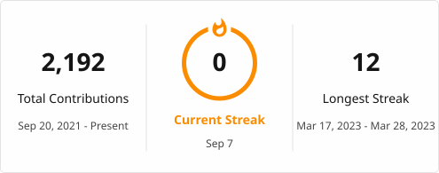

  <h1>Hi, I'm Abdourahmane GADIO 👋</h1>

  <h3>Software Engineer · Mobile Developer · Problem Solver</h3>

  

    I build reliable back-end APIs and beautiful cross-platform mobile experiences. 
    I enjoy turning ideas into practical, scalable products that people love to use.
  

  

    
    
  

## 👨‍💻 About Me

- 🔭 Focused on scalable back-end APIs and cross-platform mobile applications
- 📱 Working with Flutter and React Native to create smooth, user-friendly experiences
- ⚙️ Interested in DevOps, automation, and reliable software delivery
- 🌱 Continuously learning and improving my craft
- 🤝 Open to meaningful collaborations and open-source projects

## 🛠️ Hard Skills

### Languages & Frameworks

  
  
  
  
  

### Development Tools & DevOps

  
  
  
  
  
  

  
  
  
  
  
  

## 📊 GitHub Activity

  
  

  <i>Thanks for stopping by — feel free to explore my repositories!</i>

